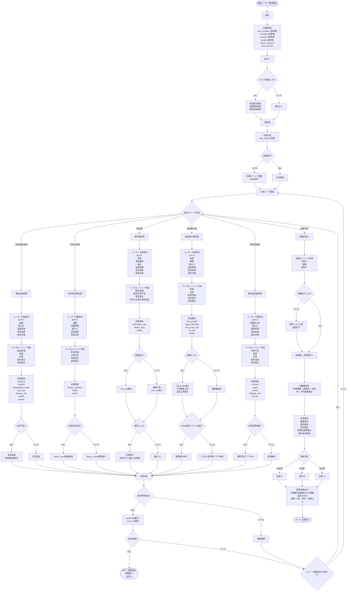

```mermaid

flowchart TD

    A([開始: いちご栽培開始]) --> B[耕起]
    B --> C[土壌初期化\nsoil_condition=基準値\nmoisture=基準値\nnutrition=基準値\nhealth=基準値\nflower_count=0\nfruit_count=0]
    C --> D[畝立て]
    D --> E{マルチ設置したか}
    E -- はい --> E1[地温安定補正\n乾燥抑制補正\n雑草抑制補正]
    E -- いいえ --> E2[補正なし]
    E1 --> F[苗定植]
    E2 --> F[苗定植]

    F --> G[活着判定\nroot_statusを更新]
    G --> H{活着成功?}
    H -- いいえ --> H1[初期ストレス増加\nhealth低下]
    H -- はい --> H2[生育開始]
    H1 --> I
    H2 --> I

    I[生育ループ開始] --> J{現在ステージ判定}

    J -- 活着/葉成長期 --> K[葉成長期処理]
    J -- 花芽形成期 --> L[花芽形成期処理]
    J -- 開花期 --> M[開花期処理]
    J -- 果実肥大期 --> N[果実肥大期処理]
    J -- 着色成熟期 --> O[着色成熟期処理]
    J -- 収穫可能 --> P[収穫処理へ]

    %% 葉成長期
    K --> K1[ユーザー行動受付\n水やり\n追肥\n葉かき\n温度管理\n害虫防除\n病気対策]
    K1 --> K2[ランダムイベント判定\n高温/低温\n乾燥\n長雨\n害虫発生\n病気発生]
    K2 --> K3[状態更新\nmoisture\nnutrition\ntemperature_stress\npest_risk\ndisease_risk\nhealth\ngrowth]
    K3 --> K4{生育不良?}
    K4 -- はい --> K5[成長遅延\n花芽数候補減少]
    K4 -- いいえ --> K6[正常成長]
    K5 --> Q
    K6 --> Q

    %% 花芽形成期
    L --> L1[ユーザー行動受付\n水やり\n追肥\n温度管理\n葉かき\n害虫防除\n病気対策]
    L1 --> L2[ランダムイベント判定\n高温/低温\n日照不足\n害虫発生\n病気発生]
    L2 --> L3[状態更新\nflower_potential\nhealth\nstress]
    L3 --> L4{花芽形成良好?}
    L4 -- はい --> L5[flower_count候補増加]
    L4 -- いいえ --> L6[flower_count候補減少]
    L5 --> Q
    L6 --> Q

    %% 開花期
    M --> M1[ユーザー行動受付\n水やり\n追肥\n受粉補助\n摘花\n温度管理\n害虫防除\n病気対策]
    M1 --> M2[ランダムイベント判定\n高温/低温\n降雨/日照不足\n害虫発生\n灰色かび等の病気発生]
    M2 --> M3[状態更新\npollination_rate\nflower_drop\nhealth]
    M3 --> M4{受粉良好?}
    M4 -- はい --> M5[fruit_set増加]
    M4 -- いいえ --> M6[着果不良\nfruit_set減少]
    M5 --> M7{摘花したか}
    M6 --> M7
    M7 -- はい --> M8[花数減少\n1果あたり品質上昇補正]
    M7 -- いいえ --> M9[補正なし]
    M8 --> Q
    M9 --> Q

    %% 果実肥大期
    N --> N1[ユーザー行動受付\n水やり\n追肥\n摘果\n葉かき\n温度管理\n害虫防除\n病気対策]
    N1 --> N2[ランダムイベント判定\n乾燥\n過湿\n高温/低温\n害虫発生\n病気発生]
    N2 --> N3[状態更新\nfruit_growth\nsugar_potential\nfruit_crack_risk\nrot_risk\nhealth]
    N3 --> N4{摘果したか}
    N4 -- はい --> N5[fruit_count減少\n平均果重上昇\n品質上昇補正]
    N4 -- いいえ --> N6[果実数維持]
    N5 --> N7{水分/栄養バランス良好?}
    N6 --> N7
    N7 -- はい --> N8[果実肥大進行]
    N7 -- いいえ --> N9[小玉化/奇形果リスク増加]
    N8 --> Q
    N9 --> Q

    %% 着色成熟期
    O --> O1[ユーザー行動受付\n水やり\n追肥控えめ\n葉かき\n温度管理\n害虫防除\n病気対策]
    O1 --> O2[ランダムイベント判定\n日照不足\n長雨\n高温\n鳥害/虫害\n病気発生]
    O2 --> O3[状態更新\ncoloring\nsugar\naroma\ndamage_risk\nrot_risk]
    O3 --> O4{成熟基準到達?}
    O4 -- はい --> O5[収穫可能フラグON]
    O4 -- いいえ --> O6[成熟継続]
    O5 --> Q
    O6 --> Q

    %% 日次・週次共通判定
    Q[共通判定] --> Q1{重大障害発生?}
    Q1 -- はい --> Q2[health大幅低下\nfruit_loss増加]
    Q1 -- いいえ --> Q3[通常継続]
    Q2 --> Q4{枯死/壊滅?}
    Q3 --> Q5{ステージ遷移条件を満たす?}
    Q4 -- はい --> Z1([終了: 収穫失敗\n収穫量=0\n品質=0])
    Q4 -- いいえ --> Q5
    Q5 -- はい --> J
    Q5 -- いいえ --> I

    %% 収穫処理
    P --> P1[収穫タイミング判定\n早採り\n適期\n遅採り]
    P1 --> P2{収穫実行したか}
    P2 -- いいえ --> P3[過熟リスク上昇\n品質低下]
    P2 -- はい --> P4[収穫量・品質算定へ]
    P3 --> P4

    P4 --> R[収穫量算定\n基準果数 × 着果率 × 生残率 × 平均果重補正]
    R --> S[品質算定\n糖度補正\n着色補正\n形状補正\n病害虫被害補正\n過熟/未熟補正]
    S --> T{等級判定}
    T -- 高品質 --> T1[品質=A]
    T -- 中品質 --> T2[品質=B]
    T -- 低品質 --> T3[品質=C]
    T1 --> U
    T2 --> U
    T3 --> U

    U[最終結果出力\n収穫量=総重量または個数\n品質=A/B/C\n備考=小玉・奇形・病斑など] --> Z([ゴール: 収穫完了])
```